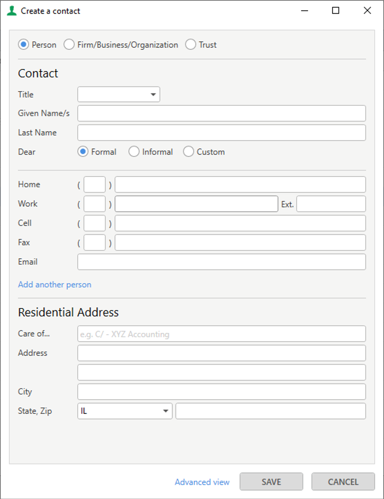
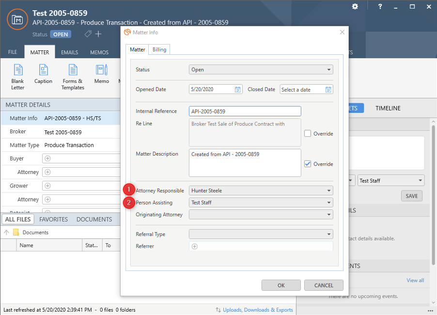
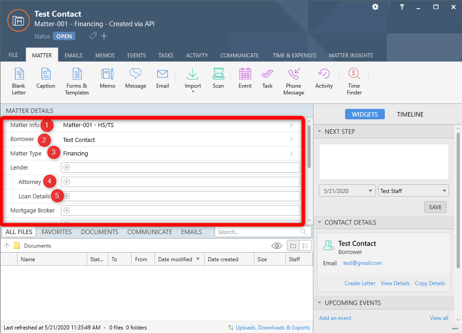
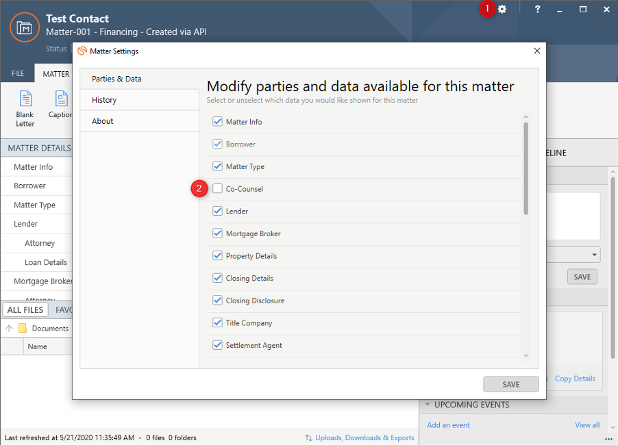
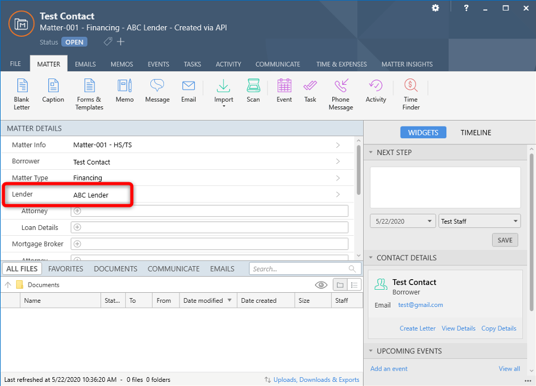

# Creating a Matter

### 1. Matter Types

Smokeball comes with a range of pre-configured matter types for different areas of law. These are provided by Smokeball’s internal content team and are not user editable.

A Matter Type defines what information can be saved to the matter, relevant to that area of law and state / location.


When creating a matter in Smokeball we can see

1. A list of Matter Types. Here, _Financing_ is a matter type, under the _Real Estate_ category.
2. Representative options for the _Financing_ matter type. This specifies who the Smokeball firm is acting for. In other words, who is their client.

#### API - Getting a Matter Type

```json http
{
  "method": "get",
  "url": "https://stagingapi.smokeball.com/mattertypes",
  "query": {
    "Location": "IL",
    "Category": "Real Estate"
  }
}
```

**Response**

```json
{
  "href": "https://stagingapi.smokeball.com/mattertypes",
  "offset": 0,
  "limit": 500,
  "size": 18,
  "first": {
    "href": "https://stagingapi.smokeball.com/mattertypes"
  },
  "value": [
    {
      "href": "https://stagingapi.smokeball.com/mattertypes/8aca3574-aecb-4a6f-991d-680861bece1d_il",
      "id": "8aca3574-aecb-4a6f-991d-680861bece1d_IL",
      "versionId": "32e86c38-534d-4362-95a1-f5c287a8d4b7",
      "name": "Financing",
      "category": "Real Estate",
      "representativeOptions": [
        "Borrower",
        "Lender",
        "MortgageBroker",
        "Seller",
        "CooperativeApartment"
      ],
      "location": "IL",
      "deleted": false
    },
    {
      "href": "https://stagingapi.smokeball.com/mattertypes/2d5aca9b-9469-44d4-8616-766a864432aa",
      "id": "2d5aca9b-9469-44d4-8616-766a864432aa",
      "versionId": "1410cfea-723e-4514-8901-c92dab1bd5f2",
      "name": "Buy",
      "category": "Real Estate",
      "representativeOptions": [
        "Buyer"
      ],
      "location": "IL",
      "deleted": false
    },
    ...
  ]
}
```

> Here the important information to note is the `id` and `representativeOptions` of the matter type. We’ll need those when creating a matter. 

---

### 2. Contacts

In order to successfully create a matter, we’re going to need to provide a contact that is the client.

In Smokeball’s desktop app you can create a contact as a Person, Firm/Business/Organization or Trust.
Right now, the API supports the following contact types

- Person
- Company



#### API - Creating a Contact

To create a contact you can make the following request which would create a person called ‘Test Contact’.

```json http
{
  "method": "POST",
  "url": "https://stagingapi.smokeball.com/contacts",
  "headers": {
    "Content-Type": "application/json"
  },
  "body": "{\n  \"person\": {\n    \"firstName\": \"Test\",\n    \"lastName\": \"Contact\",    \n    \"email\": \"test@gmail.com\",\n  }\n}\n\n"
}
```

**Response**

```json
202 Accepted

{
  "id": "9a9ce552-6bee-45e4-8eb1-afe2c18c489f",
  "href": "https://stagingapi.smokeball.com/contacts/9a9ce552-6bee-45e4-8eb1-afe2c18c489f"
}
```

Take note of the Contact’s `id` returned in the response, we’ll need that when creating a matter.
Alternatively, if the contact already exists in Smokeball, you can query it to find it’s id.

> ### _Tip_
>
> When creating a contact you can pass in an `externalSystemId` if you want to store your own reference id with this contact.

---

### 3. Staff

In Smokeball, staff can be assigned to a matter as the **Attorney Responsible** or the **Person Assisting**. The matter list can then be filtered by Attorney responsible, etc.



If you want to specify the Attorney Responsible or Person Assisting when creating a matter via the API, then we will first need to retrieve the staff member’s id.

```json http
{
  "method": "get",
  "url": "https://stagingapi.smokeball.com/staff"
}
```

**Response**

```json
{
  "href": "https://stagingapi.smokeball.com/staff",
  "size": 28,
  "first": {
    "href": "https://stagingapi.smokeball.com/staff"
  },
  "value": [

    {
      "href": "https://stagingapi.smokeball.com/staff/66f7fa24-bb03-4d89-ac28-e19620cc1e45",
      "id": "66f7fa24-bb03-4d89-ac28-e19620cc1e45",
      "versionId": "cfdbb798-1f2e-4355-87bc-620cbc62acc2",
      "firstName": "Test",
      "lastName": "Staff",
      "phone": {
        "number": "200518540309"
      },
      "cell": {},
      "email": "teststaff@gmail.com",
      "avatar": "https://staging.smokeball.com/FirmManagement/Firm/RedirectToStaffProfileImageUrl?accountId=2f3143de-2bfe-4742-9e9c-7c16b48bdef7&staffId=66f7fa24-bb03-4d89-ac28-e19620cc1e45",
      "former": false,
      "enabled": true
    },

    {
      "href": "https://stagingapi.smokeball.com/staff/c85d28cb-a760-4627-aa59-0a853c2e65ed",
      "id": "c85d28cb-a760-4627-aa59-0a853c2e65ed",
      "versionId": "23dbdc50-6171-4408-8150-413cb293a249",
      "title": "",
      "firstName": "Hunter",
      "lastName": "Steele",
      "email": "hunter@gmail.com",
      "avatar": "https://staging.smokeball.com/FirmManagement/Firm/RedirectToStaffProfileImageUrl?accountId=2f3143de-2bfe-4742-9e9c-7c16b48bdef7&staffId=c85d28cb-a760-4627-aa59-0a853c2e65ed",
      "former": false,
      "enabled": false
    },
    ...
  ]
}
```

---

### 4. Matter Creation

Now we have everything we need to create a matter.

```json http
{
  "method": "POST",
  "url": "https://stagingapi.smokeball.com/matters",
  "headers": {
    "Content-Type": "application/json"
  },
  "body": {
    "number": "Matter-001",
    "matterTypeId": "8aca3574-aecb-4a6f-991d-680861bece1d_IL",
    "clientIds": [
      "9a9ce552-6bee-45e4-8eb1-afe2c18c489f"
    ],
    "clientRole": "Borrower",
    "description": "Created via API",
    "status": "Open",
    "dateOpened": "2020-05-20T04:20:55.035Z",
    "personResponsibleStaffId": "c85d28cb-a760-4627-aa59-0a853c2e65ed",
    "personAssistingStaffId": "66f7fa24-bb03-4d89-ac28-e19620cc1e45"
  }
}
```

Here we have used:


Parameter | Description
---------|----------
 `matterTypeId` | We're using the id for `Financing` which we retrieved earlier 
 `clientIds` | An array containing the id of the `Test Contact` we created 
 `clientRole` |  Set to _Borrower_ which is one of the matter type’s representativeOptions retrieved earlier
 `personResponsibleStaffId`| Id of a staff member we retrieved from the GET Staff call
 `personAssistingStaffId` | Id of a staff member we retrieved from the GET Staff call
 `number` | Internal reference number for the matter. Some firms have enabled ‘auto numbering’ in Smokeball settings. If you provide a value for this field via the API then the matter number will be overwritten
`description` | a free text entry field for the description of the matter
`status` | can be `Open`, `Pending`, `Closed`, `Deleted` or `Cancelled`
`dateOpened` | when the matter was opened (this can be backdated if required)

**Response**

```json
202 Accepted

{
  "id": "51cefb72-6247-4ca2-8926-5d14d65f7cb9",
  "href": "https://stagingapi.smokeball.com/matters/51cefb72-6247-4ca2-8926-5d14d65f7cb9"
}
```

The matter is now shown in Smokeball:


---

### 5. Retrieving a matter

```http
GET https://stagingapi.smokeball.com/matters/51cefb72-6247-4ca2-8926-5d14d65f7cb9
```

**Response**

```json
{
  "href": "https://stagingapi.smokeball.com/matters/51cefb72-6247-4ca2-8926-5d14d65f7cb9?MatterId=51cefb72-6247-4ca2-8926-5d14d65f7cb9",
  "id": "51cefb72-6247-4ca2-8926-5d14d65f7cb9",
  "versionId": "637256184791434000",
  "number": "Matter-001",
  "matterType": {
    "id": "8aca3574-aecb-4a6f-991d-680861bece1d_IL",
    "href": "/mattertypes/8aca3574-aecb-4a6f-991d-680861bece1d_IL",
    "rel": "MatterTypes"
  },
  "clients": [
    {
      "id": "9a9ce552-6bee-45e4-8eb1-afe2c18c489f",
      "href": "/contact/9a9ce552-6bee-45e4-8eb1-afe2c18c489f",
      "rel": "Contact"
    }
  ],
  "otherSides": [],
  "description": "Created via API",
  "status": "Open",
  "personResponsible": {
    "id": "c85d28cb-a760-4627-aa59-0a853c2e65ed",
    "href": "/staff/c85d28cb-a760-4627-aa59-0a853c2e65ed",
    "rel": "Staff"
  },
  "items": {
    "id": "51cefb72-6247-4ca2-8926-5d14d65f7cb9",
    "href": "/matter/51cefb72-6247-4ca2-8926-5d14d65f7cb9/items",
    "rel": "collection"
  }
}
```

Most of this information is unchanged from what we passed in when creating the matter. You’ll notice that the clients, staff and matter type properties have been expanded as links to resources with more information.

There is also the items collection which we’ll explore in more detail next.

---

### 6. Matter Items

A matter can contain various items and sub items that store hierarchical data relevant to that area of law.



The matter items list is ordered as follows:

1. Matter Info
2. Borrower (Client)

    a. Client’s Attorney - this is always the Smokeball firm. This relationship is hidden in the desktop UI but can  be seen in the API.
3. Matter Type
4. Lender (Other Side)

    a. Other Side’s Attorney
5. Other Roles, Relationships and Layouts

Matter sub items are shown indented under the matter item. Here `Lender` is a matter item, and `Attorney` and `Loan Details` are its subitems.
Here's an example request to GET the Matter Items:

```http
GET https://stagingapi.smokeball.com/matters/51cefb72-6247-4ca2-8926-5d14d65f7cb9/items
```

**Response**

```json
{
  "versionId": "9843e3cf-9720-4ac5-94cf-1b265c5e54d5",
  "items": [
    {
      "href": "/matters/51cefb72-6247-4ca2-8926-5d14d65f7cb9/info",
      "name": "Matter Info",
      "index": 0,
      "visible": true
    },
    {
      "href": "/matters/51cefb72-6247-4ca2-8926-5d14d65f7cb9/roles/441225f5-0803-412b-be45-c81fb893231f",
      "id": "441225f5-0803-412b-be45-c81fb893231f",
      "name": "Borrower",
      "index": 0,
      "visible": true,
      "subItems": [
        {
          "href": "/matters/51cefb72-6247-4ca2-8926-5d14d65f7cb9/roles/441225f5-0803-412b-be45-c81fb893231f/relationships/04f40670-898c-4e47-9565-df8cca2569c8",
          "id": "04f40670-898c-4e47-9565-df8cca2569c8",
          "name": "Attorney",
          "index": 0,
          "visible": true
        }
      ]
    },
    {
      "href": "/mattertypes/8aca3574-aecb-4a6f-991d-680861bece1d",
      "name": "Matter Type",
      "index": 0,
      "visible": true
    },
    {
      "href": "/matters/51cefb72-6247-4ca2-8926-5d14d65f7cb9/roles/e8ea6745-399b-4234-8d62-5dd891e0ae9d",
      "id": "e8ea6745-399b-4234-8d62-5dd891e0ae9d",
      "name": "Co-Counsel",
      "index": 0,
      "visible": false
    },
    {
      "href": "/matters/51cefb72-6247-4ca2-8926-5d14d65f7cb9/roles/f377da1c-8f48-40cd-8d23-0c3b9483c6b1",
      "id": "f377da1c-8f48-40cd-8d23-0c3b9483c6b1",
      "name": "Lender",
      "index": 0,
      "visible": true,
      "subItems": [
        {
          "href": "/matters/51cefb72-6247-4ca2-8926-5d14d65f7cb9/roles/f377da1c-8f48-40cd-8d23-0c3b9483c6b1/relationships/31b6e000-9f39-47d4-8ee8-9fed5f6901f0",
          "id": "31b6e000-9f39-47d4-8ee8-9fed5f6901f0",
          "name": "Attorney",
          "index": 0,
          "visible": true
        },
        {
          "name": "Loan Details",
          "index": 0,
          "visible": true
        }
      ]
    },
    {
      "href": "/matters/51cefb72-6247-4ca2-8926-5d14d65f7cb9/roles/429371ae-a577-40a0-bf4d-ed157764ed6c",
      "id": "429371ae-a577-40a0-bf4d-ed157764ed6c",
      "name": "Mortgage Broker",
      "index": 0,
      "visible": true,
      "subItems": [
        {
          "href": "/matters/51cefb72-6247-4ca2-8926-5d14d65f7cb9/roles/429371ae-a577-40a0-bf4d-ed157764ed6c/relationships/bbf42ca4-cf70-48e2-a737-86e1f196ebc2",
          "id": "bbf42ca4-cf70-48e2-a737-86e1f196ebc2",
          "name": "Attorney",
          "index": 0,
          "visible": true
        }
      ]
     },
    ...
}
```

Where available, the matter item will have a link to the relevant resource containing additional information.

> Some matter items can be hidden on the matter by default. This is usually done for roles that aren’t common on the matter. They are still exposed in the api as "visible: false”. Currently the visibility can only be changed in the Smokeball desktop app under Matter Settings (1).



There are different types of matter items and sub items, including:

#### 

###### Roles and Relationships

A contact on a matter will be assigned to a specific role or relationship, based on how they relate to the matter. For example, in the above image, `Test Contact` is assigned to the `Borrower` role **(2)**. By convention, the first Role in the list is the firm’s client. The client role has an `Attorney` relationship that links to the Smokeball Firm (hidden in the Smokeball UI)

Contacts can also be related to other contacts on the matter. For example in the above image, `Lender` is a Role with an `Attorney` relationship **(3)**. This attorney acts for this specific Lender. There could be other Lenders relationships on this matter that are related to other roles (not shown in image)

Roles and relationships can be set in the API.

#### 

###### Layouts

Layouts are data entry screens that are tailored to the area of law. In this example there is a `Loan Details` layout **(4)** that would store information about that Lender’s loan. A layout can either be a sub item linked to a matter item (e.g. Loan Details as shown here) or a matter item itself (e.g. Property Details, not shown).

Following is a typical flow to get/set layout data.

1. Get the layout design ID and currently set data by retrieving all the layout matter items
``` http
GET https://stagingapi.smokeball.com/matters/{matterId}/layouts
```
or a single layout matter item.
``` http
GET https://stagingapi.smokeball.com/matters/{matterId}/layouts/{itemId}
```
Example response:
``` json
{
    "id": "60efd655-cd1a-42cd-a170-a228cc09b5b1",
    "href": "https://stagingapi.smokeball.com/matters/3f0cfc3d-be5d-4a70-88ac-e099a800d46d/layouts/60efd655-cd1a-42cd-a170-a228cc09b5b1",
    "itemId": "60efd655-cd1a-42cd-a170-a228cc09b5b1",
    "index": 0,
    "layoutDesign": {
        "id": "f2654144-ab55-45ec-9852-489a5caaa111",
        "href": "https://stagingapi.smokeball.com/layouts/f2654144-ab55-45ec-9852-489a5caaa111",
        "rel": "Layouts"
    },
    "values": [],
    "events": []
}
```

2. Retrieve the full list of fields for the given layout design.
``` http
GET https://stagingapi.smokeball.com/layouts/{layoutDesignId}
```
Example response:
``` json
{
    "id": "f2654144-ab55-45ec-9852-489a5caaa111",
    "href": "https://stagingapi.smokeball.com/layouts/f2654144-ab55-45ec-9852-489a5caaa111",
    "fields": [
        {
            "name": "Matter/SettlementNegotiations/SettlementNegotiationsDetails/Note",
            "type": "Text"
        },
        {
            "name": "Matter/SettlementNegotiations/SettlementNegotiationsDetails/OfferDate",
            "type": "DateTime"
        },
    ],
    "name": "Settlement Negotiations - Personal Injury"
}
```

3. Update the layout with new data values.
```http
PATCH https://stagingapi.smokeball.com/matters/{matterId}/layouts/{itemId}

{
    "values": [
        {
            "key": "Matter/SettlementNegotiations/SettlementNegotiationsDetails/Note",
            "value": "New note"
        }
    ]
}
```

> Note: a field with type `Role` expects an ID of a role. The name of the role needs to be the same as the layout field (e.g. for a field with key `Matter/CaseDetails/StandardCaseDetails/Judge` expected role name is `Judge`). 

> Note: a field with type `DateTime` expects a UTC date/time in [ISO 8601](https://en.wikipedia.org/wiki/ISO_8601) format (e.g. `2021-10-12T13:00:00.0000000Z`).


---

### 7. Roles

To find out which contact is assigned to a role, we can get retrieve the role details:

```http
GET https://stagingapi.smokeball.com/matters/51cefb72-6247-4ca2-8926-5d14d65f7cb9/roles/441225f5-0803-412b-be45-c81fb893231f
```

**Response**

```json
{
  "id": "441225f5-0803-412b-be45-c81fb893231f",
  "name": "Borrower",
  "contact": {
    "id": "9a9ce552-6bee-45e4-8eb1-afe2c18c489f",
    "href": "/contact/9a9ce552-6bee-45e4-8eb1-afe2c18c489f",
    "rel": "Contact"
  },
  "representatives": [],
  "relationships": [
    {
      "id": "04f40670-898c-4e47-9565-df8cca2569c8",
      "name": "Attorney",
      "contact": {
        "href": "/firm/",
        "rel": "Firm"
      },
      "representatives": []
    }
  ]
}
```

Here we can see the Borrower role has a contact assigned, and we can follow the link to the contact resource to find out more details. We can also see that there is an Attorney relationship that links to the Firm resource.

#### Setting a Role

In our example, the Lender role did not have a contact assigned. To set this, we first need to know the id / link to the role we want to update. This was retrieved earlier with the MatterItems api call:

```http
GET https://stagingapi.smokeball.com/matters/51cefb72-6247-4ca2-8926-5d14d65f7cb9/items
```

**Response**

```json
{
  "versionId": "9843e3cf-9720-4ac5-94cf-1b265c5e54d5",
  "items": [
    ...
    {
      "href": "/matters/51cefb72-6247-4ca2-8926-5d14d65f7cb9/roles/f377da1c-8f48-40cd-8d23-0c3b9483c6b1",
      "id": "f377da1c-8f48-40cd-8d23-0c3b9483c6b1",
      "name": "Lender",
      "index": 0,
      "visible": true,
      "subItems": [
        {
          "href": "/matters/51cefb72-6247-4ca2-8926-5d14d65f7cb9/roles/f377da1c-8f48-40cd-8d23-0c3b9483c6b1/relationships/31b6e000-9f39-47d4-8ee8-9fed5f6901f0",
          "id": "31b6e000-9f39-47d4-8ee8-9fed5f6901f0",
          "name": "Attorney",
          "index": 0,
          "visible": true
        },
        {
          "name": "Loan Details",
          "index": 0,
          "visible": true
        }
      ]
    },
    ...
}
```

Let’s say we’ve already created a contact called ‘ABC Lender’ with id ` dcafdb9e-e46d-4720-a3f8-638b3dd4ca38` and now we want to assign it to this matter in the Lender role

```json http
{
  "method": "PUT",
  "url": "https://stagingapi.smokeball.com/matters/51cefb72-6247-4ca2-8926-5d14d65f7cb9/roles/f377da1c-8f48-40cd-8d23-0c3b9483c6b1",
  "headers": {
    "Content-Type": "application/json"
  },
  "body": {
    "contactId": "dcafdb9e-e46d-4720-a3f8-638b3dd4ca38"
  }
}
```

**Response**

```json
202 Accepted

{
  "id": "f377da1c-8f48-40cd-8d23-0c3b9483c6b1",
  "href": "https://stagingapi.smokeball.com/matters/51cefb72-6247-4ca2-8926-5d14d65f7cb9/roles/f377da1c-8f48-40cd-8d23-0c3b9483c6b1"
}
```


